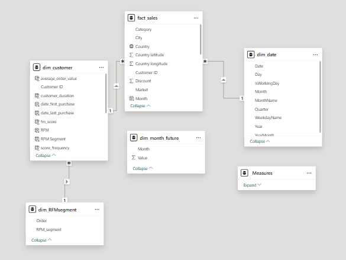
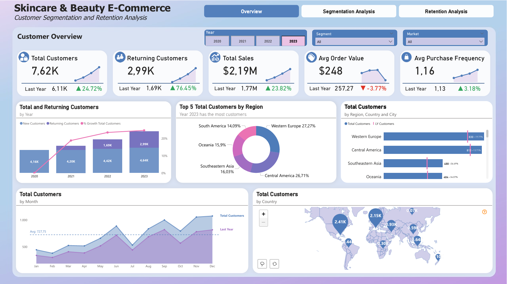
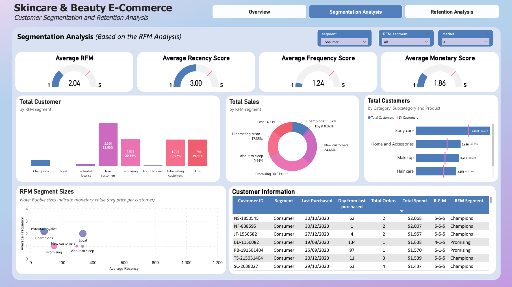
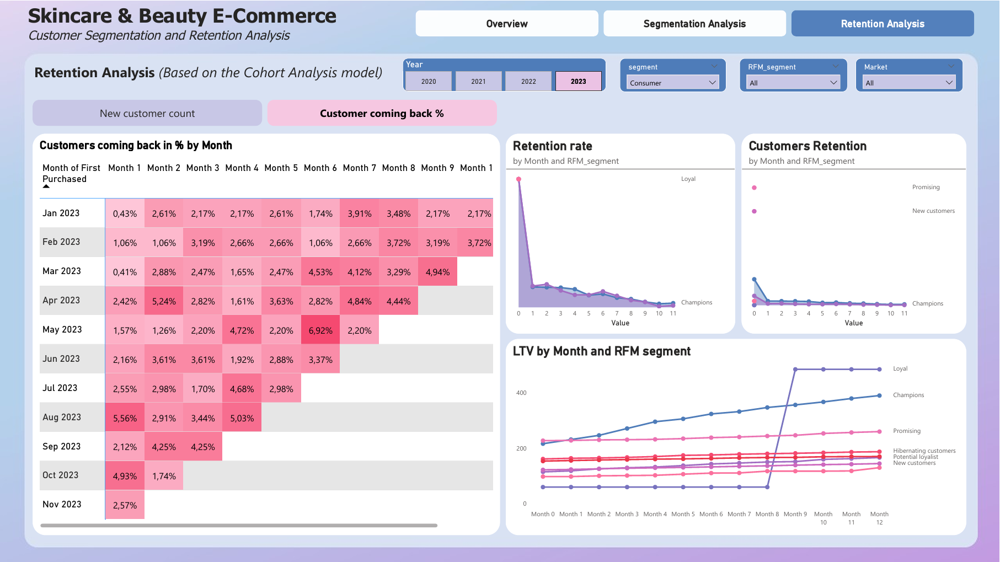

# <p align="center"> CAPSTONE PROJECT
</p>

# <p align="center">  📊 Customer Segmentation & Retention Analysis for Skincare & Beauty E-Commerce with Power BI
</p>

<p align="center"> <strong>Author:</strong> Phan Anh Hoang
</p>

## Project Overview

This portfolio project presents a comprehensive **Customer Retention Analysis** and **Customer Segmentation Analysis** using Power BI for a global skincare and beauty e-commerce store. The project leverages advanced analytical techniques including RFM modeling and Cohort analysis to provide actionable insights for improving customer loyalty and optimizing marketing strategies.

👉 [Access Power BI Report PDF Visualization](E-Commerce_C19_FP20analytics_English.pdf)  
👉 [Download Interactive Power BI Report (.pbix)](E-Commerce_C19_FP20analytics_English.pbix)

---
## Table of Contents
  - **[🧰 A. Key Project Information](#-a-key-project-information)**
  - **[🎯 B. Project Goals \& Stakeholder Needs](#-b-project-goals--stakeholder-needs)**
  - **[ ⚙  C. Project Execution](#-c-project-execution)**
  - **[💡 D. Strategic Recommendations](#-d-strategic-recommendations)**
  - **[🚀 Conclusion](#-conclusion)**

---

## 🧰 A. Key Project Information

### 1. Tools & Skills Used

- **Power Query**: Applied in-depth Power Query knowledge for efficient data transformation, cleaning, and preparation with **51,290 transaction records**
- **Data Modeling**: Utilized advanced data modeling techniques including star schema to create optimized data model with fact and dimension tables
- **DAX (Data Analysis Expressions)**: Developed complex measures and calculated columns for:
  - RFM scoring (Recency, Frequency, Monetary)
  - Customer segmentation logic
  - Cohort retention rates
  - Customer Lifetime Value (LTV) calculations
- **Data Visualization**: Designed and implemented appropriate chart types including:
  - Matrix tables for cohort analysis
  - Scatter charts for RFM segment visualization
  - Area charts for trend analysis
- **Report Interactivity**: Integrated essential functionalities such as:
  - Drill-down and drill-through capabilities
  - Tooltip pages for contextual information
  - Slicers for dynamic filtering (Segment, RFM_segment, Year, Market)
  - Bookmarks for navigation between analysis pages
- **Report Design**: Created complete and professional three-page report layout suitable for executive presentation

### 2. Project Introduction

This project is built upon a comprehensive order dataset capturing the complete e-commerce transaction history of a global skincare and beauty retailer.

#### a) About the Company

The company is an anonymous global online retailer specializing in skincare and beauty products. Key characteristics:

- **Geographic Reach**: Serves 164 countries across multiple markets (Western Europe, Central America, Southeast Asia, Oceania, South America)
- **Product Portfolio**: Offers nearly 4,000 products across 5 main categories: Body care, Home and Accessories, Make up, Hair care, and Face care
- **Sales Channel**: Pure-play e-commerce model operating through online platforms
- **Customer Segments**: Serves Consumer, Corporate, and Self-Employed segments

#### b) Company Data Description

The dataset is provided by **FP20 Analytics** and contains historical order data with the following structure:

| Field | Description |
|-------|-------------|
| **Row ID** | Unique identifier for each row |
| **Order ID** | Order identifier (one order can contain multiple items) |
| **Order Date** | Date when order was placed |
| **Customer ID** | Customer identifier (one customer can place multiple orders) |
| **Segment** | Customer segment (Consumer/Corporate/Self-Employed) |
| **City** | Order city |
| **State** | Order state (where applicable) |
| **Country** | Order country |
| **Country latitude/longitude** | Geographic coordinates |
| **Region** | Geographic region (Western Europe, Central America, etc.) |
| **Market** | Market classification |
| **Subcategory** | Product subcategory |
| **Category** | Product category (Body care, Face care, etc.) |
| **Product** | Product name |
| **Quantity** | Number of products purchased per order |
| **Sales** | Total sales amount in USD |
| **Discount** | Discount applied to the order |
| **Profit** | Total profit after discount |

**Data Source**: [FP20 Analytics Dataset](https://fp20analytics.com/wp-content/uploads/2024/08/English-Dataset.zip)

---

## 🎯 B. Project Goals & Stakeholder Needs

### 1. Scenario

As a BI Analyst supporting the Customer Service department, I was tasked with building comprehensive Power BI reports to analyze customer behavior, segmentation, and retention patterns. This analysis would inform strategic decisions on customer acquisition, retention programs, and targeted marketing campaigns.

### 2. Stakeholder Requirements

The Head of Customer Service requested data transformation and analysis within Power BI to provide the following insights:

#### a) Customer Segmentation Analysis (RFM Model)

**Objective**: Classify the customer base using the RFM (Recency-Frequency-Monetary) model to enable targeted marketing and customer care programs.

**Requirements**:
- Calculate individual and aggregate RFM metrics:
  - **Recency**: Days since last purchase
  - **Frequency**: Total number of orders
  - **Monetary**: Total purchase value
- Assign RFM scores (1-5 scale) to each customer
- Classify customers into strategic segments
- Calculate customer counts and characteristics for each segment
- Analyze demographic distribution across segments
- Create detailed customer-level RFM tables with full demographic data

#### b) Customer Retention Analysis (Cohort Analysis)

**Objective**: Understand patterns of new customer acquisition and retention over time to improve retention strategies.

**Requirements**:
- Calculate number of new customers acquired by Month
- Calculate percentage of new customers returning for subsequent purchases by Month
- Create cohort matrix tables displaying:
  - Number of new customers by cohort month
  - Customer retention rates across subsequent months
- Implement comprehensive filtering capabilities using slicers:
  - Segment (Consumer/Corporate/Self-Employed)
  - RFM segment
  - Year
  - Market
  - Region/Country/City hierarchy

#### c) Customer Lifetime Value (LTV) Analysis

**Objective**: Track and predict the cumulative value customers bring throughout their lifecycle.

**Requirements**:
- Calculate LTV by cohort month and RFM segment
- Track LTV progression over 12-month period
- Identify high-value customer segments for investment prioritization

---

## ⚙ C. Project Execution

### 1. Data Collection & Understanding

- Downloaded FP20 Analytics dataset (Excel format)
- Explored data structure, relationships, and data quality
- Identified **51,290 valid transactions** across **17,415 unique customers**
- Analyzed date range: 2020-2023 (primary focus on 2023)

### 2. Data Preparation & Modeling

**Power Query Transformations**:
- Removed null values in critical fields (Customer ID, Sales, Quantity)
- Created calculated columns for:
  - RFM metrics calculation
  - RFM scoring
  - RFM segments
  - Date values for cohort analysis
- Filtered invalid transactions

**Data Model (Power Pivot)**:
- Implemented star schema with:
  - **Fact Table**: fact_sales (grain: one row per product in order)
  - **Dimension Tables**: 
    - dim_customer
    - dim_date (2020-2023)
    - dim_RFMsegment

<p align="center">
  
</p>

**Key DAX Measures**:

```dax
// Customer Metrics
Total Customers = DISTINCTCOUNT(fact_sales[Customer ID])
Returning Customers = [Total Customers] - [Total New Customers]

// Revenue Metrics
Total Sales = SUM(fact_sales[Sales])
Avg Order Value = DIVIDE(SUM(fact_sales[Sales]), COUNT(fact_sales[Order ID]))
Avg Purchase Frequency = DIVIDE(COUNT(fact_sales[Order ID]), DISTINCTCOUNT(fact_sales[Customer ID]))
```

**Key Calculated Columns**:

```dax
// RFM Calculations
total_recency = DATEDIFF([date_last_purchase], MAX(fact_sales[Order Date]), DAY)
total_frequency = CALCULATE(DISTINCTCOUNT(fact_sales[Order ID]))
total_monetary = CALCULATE(SUM(fact_sales[Sales]))

// RFM Scoring (1-5 scale using PERCENTILE.EXC)
```
**LTV Formula**: This project uses the simplified LTV calculation:  
**LTV = Cumulative Revenue Over Time / Total Number of Customers**

### 3. 📈 Key Insights and Visualizations

Developed interactive three-page report:

#### **Page 1: Customer Overview** (focused on 2023)
<p align="center">
  
</p>

### 📍 Customer Overview Insights (2023)

* **Customer base up, retention improved:** Total customers +24.72%, returning customers +76.45% → strong acquisition and better retention.
* **Revenue up, AOV down:** Revenue +23.82% but AOV –2.54% → growth driven by volume, not order value; upsell/cross-sell needed.
* **Purchase frequency still low:** 2.3 purchases/year (~every 5 months) → below the 1–3 month skincare cycle.
* **SEA & Oceania growing fastest:** Growth nearly double other regions → priority expansion markets.
* **Western Europe & Central America remain core:** Over 50% of total customers → must remain stable while scaling elsewhere.

#### **Page 2: Segmentation Analysis (RFM)** (focused on 2023)
<p align="center">
  
</p>

### 🎯 RFM Segmentation Insights

* **Overall RFM good but Frequency weak:** Strong Recency and decent Monetary, but low Frequency remains the bottleneck.
* **Champions booming:** +142% YoY, 44% of revenue, excellent RFM profile; however Recency is still longer than ideal.
* **Promising growing but still one-time buyers:** +117% revenue but Frequency = 1 → high-value customers not returning.
* **Loyal segment collapsing:** –66% revenue, Recency worsening → clear sign of churn.
* **New Customers exploding but low value:** +770% customers but only 4.9% of sales; very low AOV → leaky bucket.
* **About to Sleep near extinction:** –90% revenue → severe churn.
* **Three segments vanished (–100%):** Evidence of systemic churn.
* **Potential Loyalists have upside:** Higher Frequency than Loyal → strong upgrade potential.
* **Need Attention declining:** On track to fall into About to Sleep.
* **Body care dominates, Face care underpenetrated:** Large cross-sell opportunity.

#### **Page 3: Retention Analysis (Cohort)**
<p align="center">
  
</p>

### 📅 Retention (Cohort Analysis) Insights

* **Large cohorts but low retention:** Month 1–3 only 2.7–4% → strong acquisition, weak repurchase.
* **Some cohorts show recovery:** Likely from seasonal demand or reactivation.
* **Champions retain best:** Maintain 4–6% across several months.
* **Loyal & Need Attention retain poorly:** Loyal <1% by Month 6 → high churn risk.
* **Potential Loyalists show promise:** Higher early retention than Loyal → worth activating.
* **Promising, New Customers and About to Sleep** only have 100% at Month 0

### 💰 LTV Analysis Insights

* **Three segments frozen in LTV:** New, Promising, About to Sleep → no LTV growth, no repurchase.
* **Champions deliver highest ROI:** ~$496 LTV → CAC can be high and still profitable.
* **Loyal growth stagnates:** Nearly flat after month 9 → low purchase motivation.
* **Potential Loyalists = hidden gem:** Low LTV but strong +26.7% growth → long-term potential.
* **Massive LTV gap:** Champions 10× New → highly uneven value distribution.
* **LTV grows unevenly across segments:** Each group has distinct behaviors → requires tailored strategies.

---

### 🌎 Overall Insights – Summary

The store is growing strongly thanks to ***new customer acquisition***, but most customers ***purchase only once and then churn***. High-value segments are declining, LTV is stagnant, and retention is weak across the entire system.

**THE BIGGEST PROBLEM**
👉 **Purchase frequency is the strategic bottleneck.**
The store lacks an engine to convert new customers into repeat buyers — causing the entire customer ecosystem to erode.

---

## 💡 D. Strategic Recommendations

- **1. Increase Repeat Purchases Early**

Focus on converting first-time buyers into second-time buyers within 30–60 days through timely reminders, small incentives, and helpful product guidance.

- **2. Create a Consistent Product Usage Routine**

Introduce clear routines, refill reminders, and simple product bundles to encourage customers to repurchase on a regular skincare cycle.

- **3. Strengthen Loyalty & Prevent Churn**

Offer meaningful rewards, early-access perks, and personalized follow-ups to keep high-value customers engaged instead of drifting away.
---

**Tools**: Power BI Desktop | Power Query | DAX | Excel  
**Techniques**: RFM Analysis | Cohort Analysis | Customer Segmentation | LTV Modeling  
**Industry**: E-Commerce | Retail | Beauty & Skincare